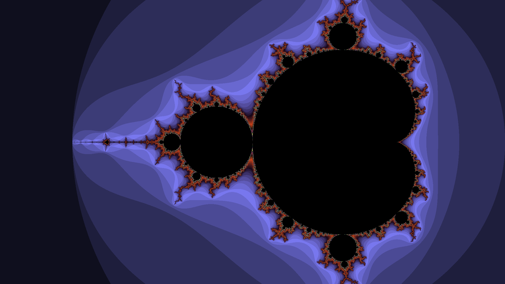

# Mandelbrot Fractal Renderer

This is a [Mandelbrot](https://en.wikipedia.org/wiki/Mandelbrot_set) fractal renderer written in Rust.


*1280x720 render using XAOS color palette*

## Features
- Multithreading with [Rayon](https://docs.rs/rayon/latest/rayon/)
- SIMD using AVX2 auto-vectorization

## Build
To build with AVX2 support run the follow command
```sh
RUSTFLAGS='-C target-feature=+avx2' cargo build --release
```

## Benchmarks
benchmark results on an i3-5005U CPU @ 2.00GHz for generating 1280x720 px image with 1000 iterations

| Version         | CPU utilized | Instructions (B) | Time elapsed (s) | 
| --------------- | ------------ | ---------------- | ---------------- |
| non-parallel    | 0.999        | 3.505            | 1.204244         |
| parallel        | 3.839        | 3.485            | 0.36724          |
| parallel-avx2   | 3.792        | 0.864            | 0.121628         | 
